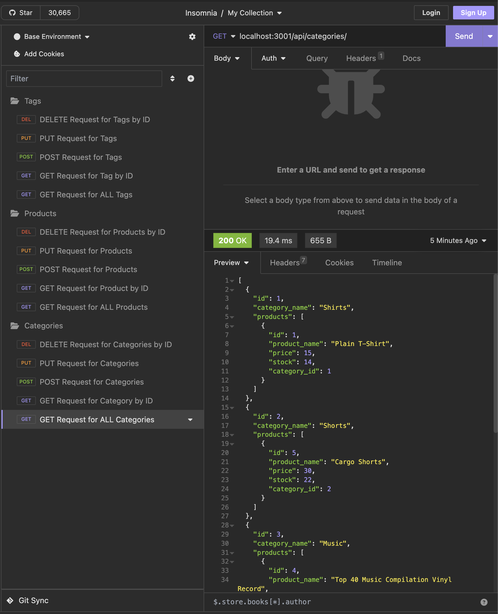

# E-Commerce-Back-End

## Overview
This is a RESTful API for product management. The API allows users to perform CRUD (Create, Read, Update, Delete) operations on products, categories, and tags.

## Features
-Create new products, categories, and tags.  
-Update existing products, categories, and tags.  
-Delete products, categories, and tags.  
-Retrieve a list of all products, categories, or tags.  
-Retrieve a single product, category, or tag by its ID.  

## Technologies Used
-JavaScript
-Model, View, Controller Framework
-MySQL
-Insomnia

## Video demonstration using Insomnia:
[Google Drive Video Link](https://drive.google.com/file/d/16Cl3CKaTQF2lrdeMcTbMg4eGhSLlzPN0/view)

## Photo of testing with Insomnia:

